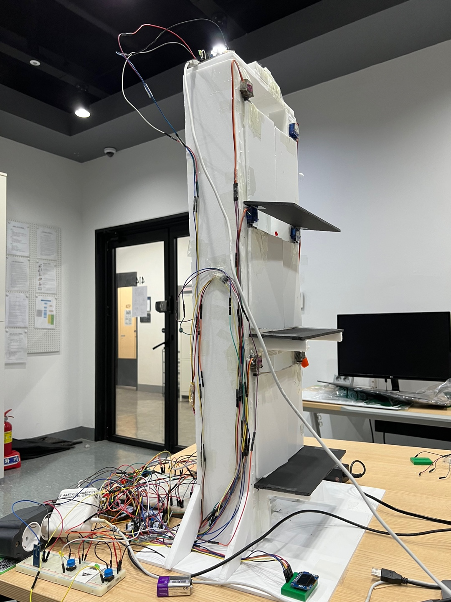

# Elevator
UART 통신을 사용하여 Controller가 Door와 Elevator에게 신호를 주는 방식으로 동작하는 Elevator를 구현한다. (Controller, Door, Elevator) 총 3개의 보드로 구성되어 있으며 층 이동, 무게 초과 감지, 비상벨, 문 열기, 현재 층 표시 등의 기능을 제공

## Elevator IMAGE

 

## 사용된 부품

1. NUCLEO-F411RE
2. CRT94077W & HX711
3. 28BYJ-48
4. ULN2003
5. MG90S, SG90
6. HC-SR04 
7. Piezo buzzer 
8. Monochrome 0.96" 128x64 OLED
9. Tact Button 

## 프로젝트 시나리오

1. Elevator 동작이 시작되면 initiation을 과정을 거치면서 1층으로 내려간다. 내려가는 중에는 initiation 중 이라는 것을 표현하기 위해 Elevator에 달려있는 LED가 켜진다.

2. PC의 terminal을 통해서 1층을 입력한 뒤, 1층에서 정상적으로 멈추는지 확인하고 해당 층의 문이 정상적으로 동작하는지 확인한다.

3. PC의 terminal을 통해서 2층을 입력한 뒤, 2층에서 정상적으로 멈추는지 확인하고 해당 층의 문이 정상적으로 동작하는지 확인한다.

4. PC의 terminal을 통해서 3층을 입력한 뒤, 3층에서 정상적으로 멈추는지 확인하고 해당 층의 문이 정상적으로 동작하는지 확인한다.

5. PC의 terminal을 통해서 2층을 입력한 뒤, Elevator가 내려가는 도중에 비상벨 버튼을 누른다. 이때 Elevator의 동작이 2초동안 멈추고, 이어서 같은 동작을 하는지 확인한다.

6. 2층에 도착한 후 문이 열렸을 때, 열림버튼을 누른다. 버튼을 누르는 동안 문이 닫히지 않는 것을 확인한다.

7. PC의 terminal을 통해서 다시 2층을 입력한 뒤 문이 열렸을 때, 실을 수 있는 정량보다 무거운 물체를 Elevator에 싣는다. 이때 정량초과를 의미하는 LED가 켜지는 것을 확인하고, 물체를 내릴 때 까지 문이 닫히지 않는 것을 확인한다.

## 구현한 기능
1. Ultrasonic를 사용하여 Elevator의 현재 높이를 알아내고, OLED를 통해 Elevator 현재 층을 알려준다.
2. Step motor / 도르래 / 추 를 사용해 Elevator를 올리고 내릴 수 있다.
3. Servo motor를 이용하여 층마다 문을 열고 닫을 수 있다.
4. HX711센서를 사용하여 Elevator의 부하된 무게를 측정할 수 있다.
5. 스위치를 사용하여 비상벨과 문 열기 버튼을 구현하여, Door 와 Elevator의 동작을 제어할 수 있다.

## 시나리오 영상

https://youtu.be/LzH9U8aw81g

